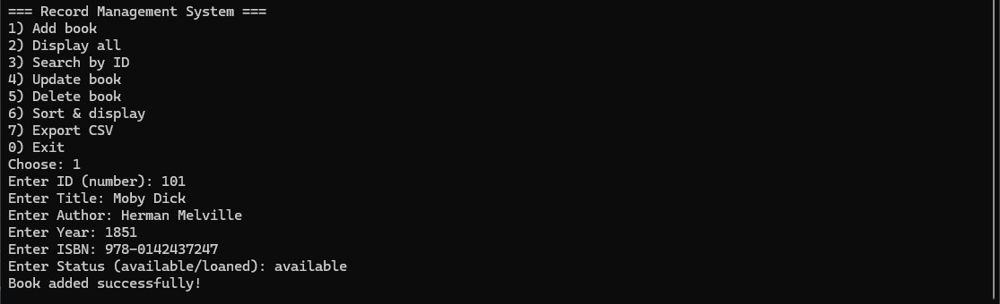
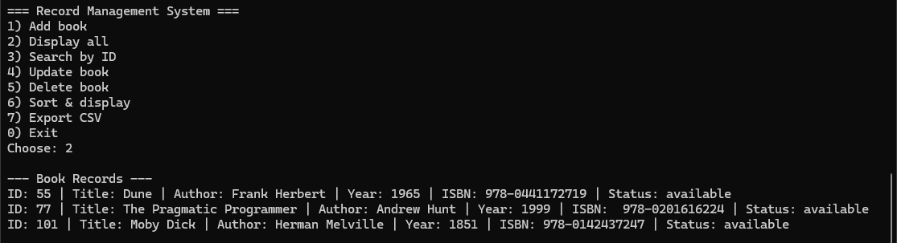
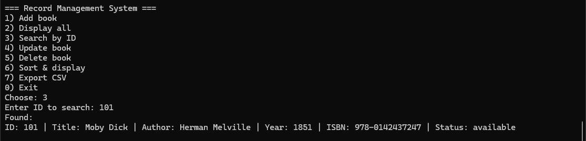
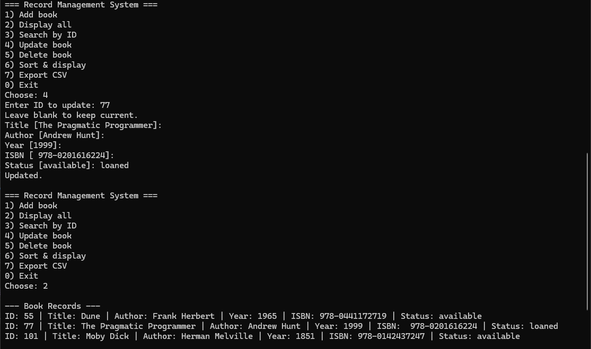
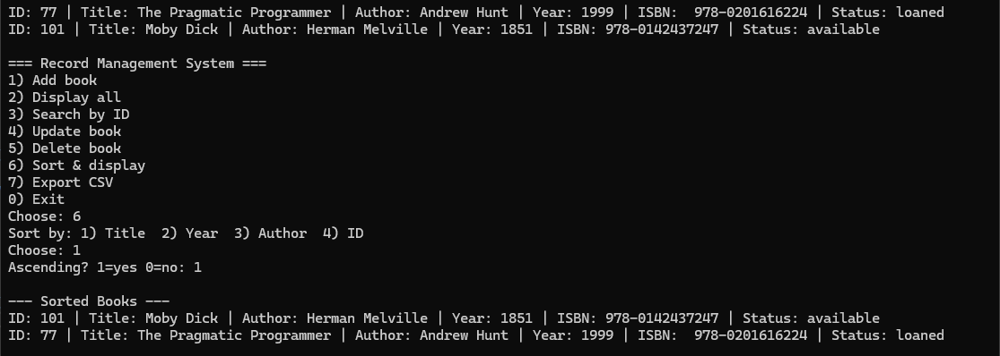
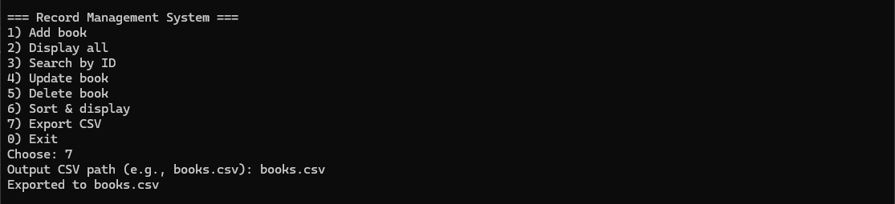

# Record Management System (C++)

A simple *file-based Record Management System* written in *C++*.  
This project demonstrates core CRUD operations (Create, Read, Update, Delete), sorting, searching, and exporting records to CSV — all through a *command-line interface (CLI)*.

---

## ✨ Features

- *Add Record* → Add a new book with ID, title, author, year, and status.  
- *Display Records* → List all saved books from the file.  
- *Search by ID* → Quickly find a book using its unique ID.  
- *Update Record* → Modify book details by selecting ID.  
- *Delete Record* → Remove a book entry by ID.  
- *Sort Records* → Sort the list of books (by title or year).  
- *Export to CSV* → Save all book records into books.csv for external use.  
- *File-based storage* → Records are stored in books.dat for persistence between runs.  

---

## 📂 Project Structure

RecordManager/
├── App.cpp / App.hpp            # Main application logic
├── Book.cpp / Book.hpp          # Book entity (struct/class)
├── FileBookStore.cpp / .hpp     # Handles file I/O for records
├── IBookStore.hpp               # Interface for the store
├── RecordManager.cpp            # Entry point (main function)
├── books.dat                    # Binary file storing records
├── books.csv                    # Exported CSV file
├── screenshots/                 # Demo screenshots
│   ├── add_book.png
│   ├── displaybooks.png
│   ├── id_search.png
│   ├── update.png
│   ├── delete.png
│   ├── sort.png
│   └── export_csv.png
└── README.md

---

## 🖥 Example Screenshots

### Add Book  
  

### Display All Books  
  

### Search by ID  
  

### Update Record  
  

### Delete Record  
  

### Sort Records  
  

### Export to CSV  
  

---

## ⚙ How It Works

1. *Data storage* → Records are written into a binary file books.dat.  
2. *Reading & Displaying* → File is scanned and records are displayed in tabular format.  
3. *Search / Update / Delete* → Records are located by ID, then updated or removed.  
4. *Sorting* → Records are read into memory, sorted, then displayed.  
5. *Export* → Records are written into books.csv in standard CSV format.  

---

## ▶ How to Run

1. Clone or download the repository.  
2. Open the project in *Visual Studio*.  
3. Build and run the solution (RecordManager.sln).  
4. Use the CLI menu to interact with the system:

  1.	Add Record
	2.	Display All Records
	3.	Search by ID
	4.	Update Record
	5.	Delete Record
	6.	Sort Records
	7.	Export to CSV
	8.	Exit

---

## 🛠 Requirements

- Visual Studio 2022 (or later)  
- C++17 enabled in project settings  

---

## 📌 Notes

- This project does *not* use MySQL or any external database.  
- All persistence is handled with a **binary file (books.dat)** and optional **CSV export (books.csv).  
- Input validation is included (e.g., preventing duplicate IDs, invalid years).  

---

## 🚀 Future Improvements

- Add filtering (e.g., search by title or author).  
- Support multiple record types (students, employees, etc.).  
- Add JSON/SQLite export option.
